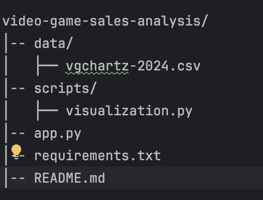
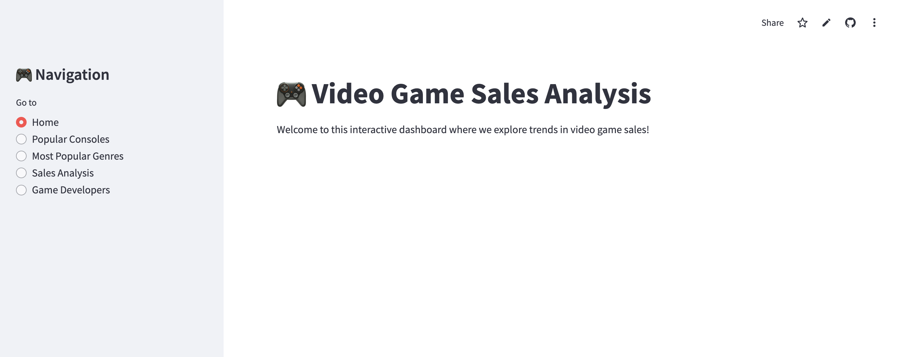
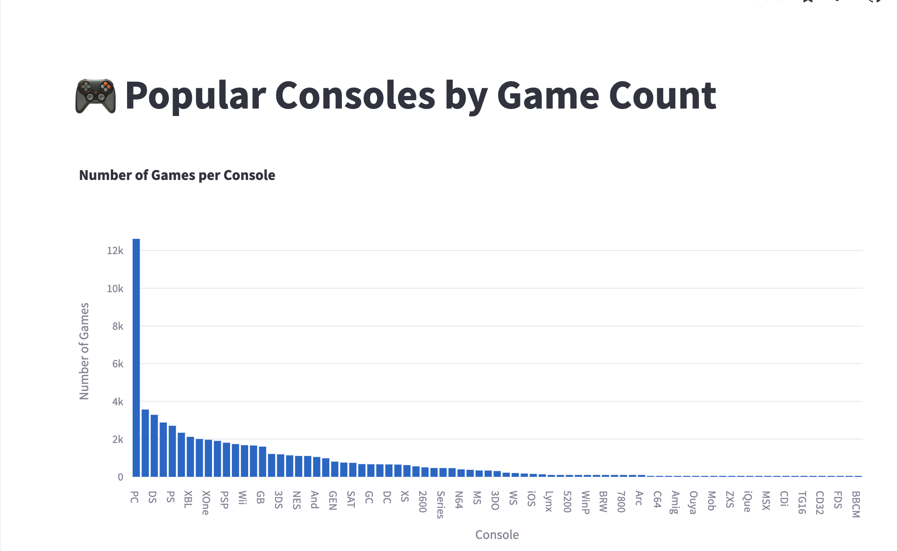
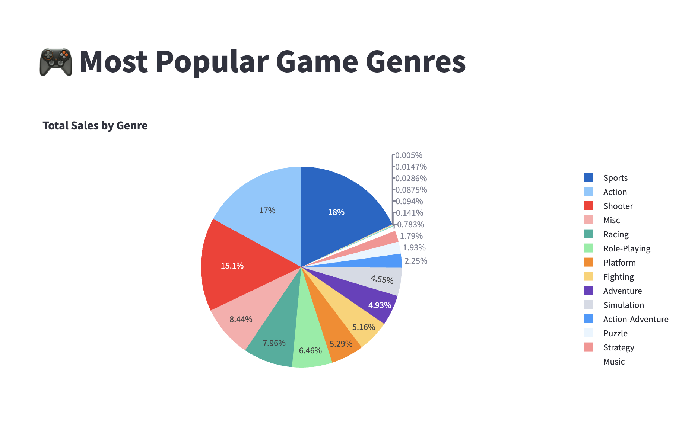
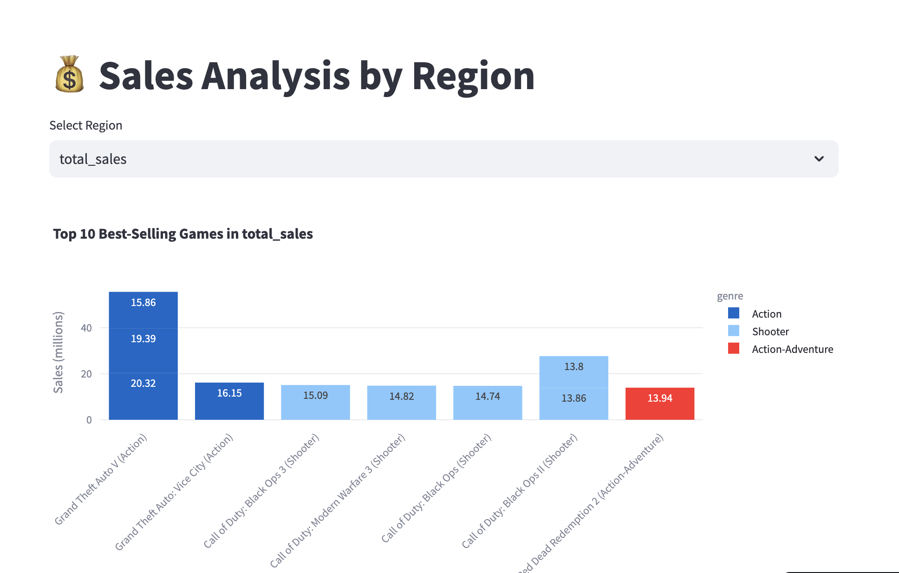
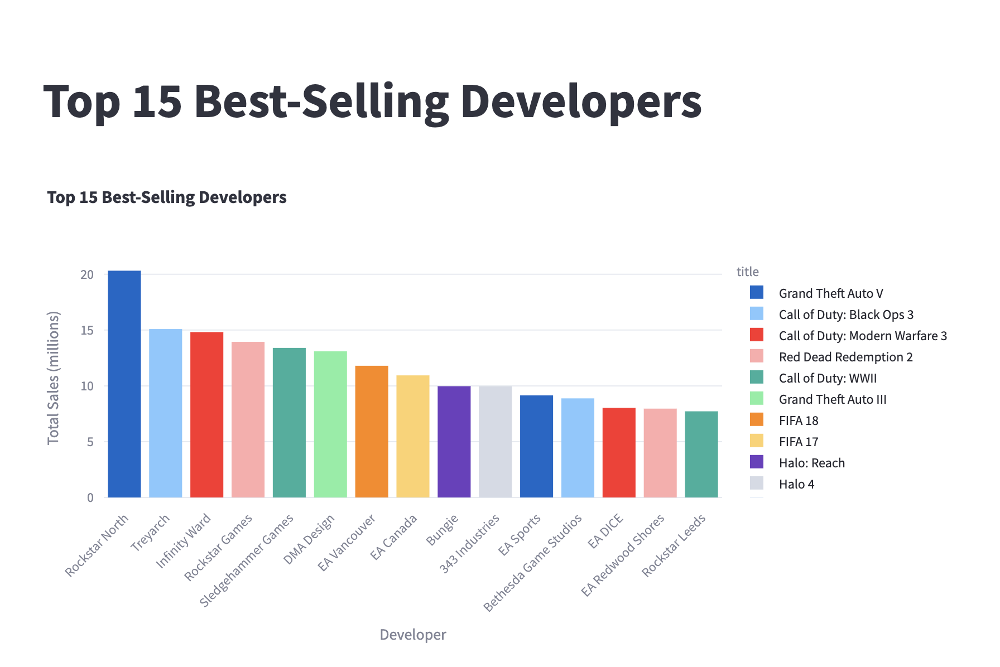

 ## 🎮 Video Game Sales Analysis

### Description

#### Video Game Sales Analysis is a data visualization project that analyzes sales trends across different consoles, genres, and regions. It provides interactive visualizations to help users explore game popularity and trends over time.

##### Features

📊 Analyze top-selling consoles

🎮 Explore the most popular game genres

🌍 Visualize regional sales (NA, JP, PAL, Other)

📈 Trend analysis of game releases

🚀 Interactive dashboard powered by Streamlit

#### Installation

To install the required dependencies, run:

pip install -r requirements.txt

#### Usage
***

To start the Streamlit app, run:

streamlit run app.py

Local URL: https://video-game-sales-analysis-dv3amejnepd9inv8dbrhme.streamlit.app/

#### Project Structure
***

           

##### Sample Visualizations
***

#### Future Improvements

🔥 Machine Learning predictions for game sales

🎨 Enhanced UI/UX with more interactivity

📊 Deeper analysis including user & critic scores

#### Acknowledgments  

- **Dataset sourced from [Kaggle](https://www.kaggle.com/)**  
- Built using **Pandas**, **Streamlit**, **Matplotlib**, **Seaborn**, and **Plotly** 
- This project is part of my learning journey to improve my **data analysis and visualization skills**  

MIT

##### Connect With Me

💼 LinkedIn: www.linkedin.com/in/aliona-janusko

🏆 GitHub: Aliona83
